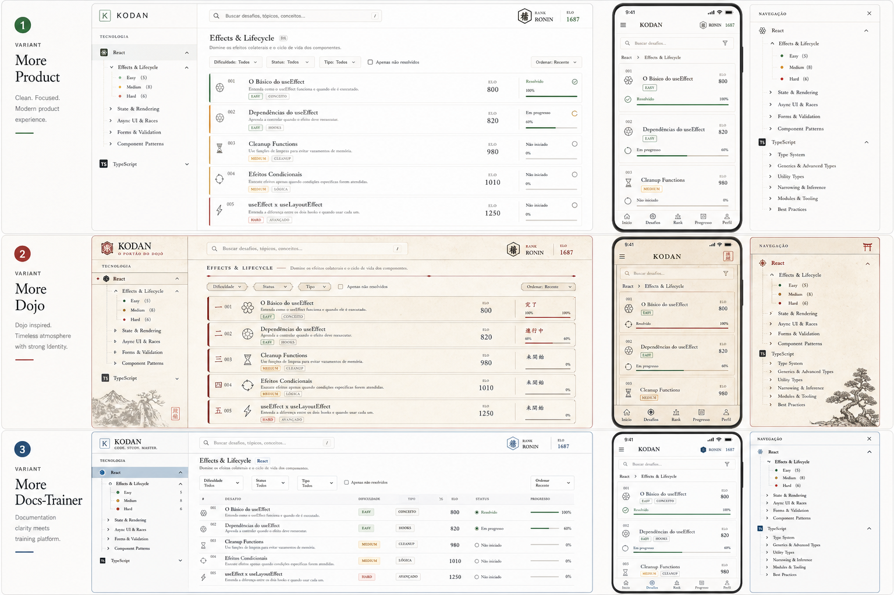
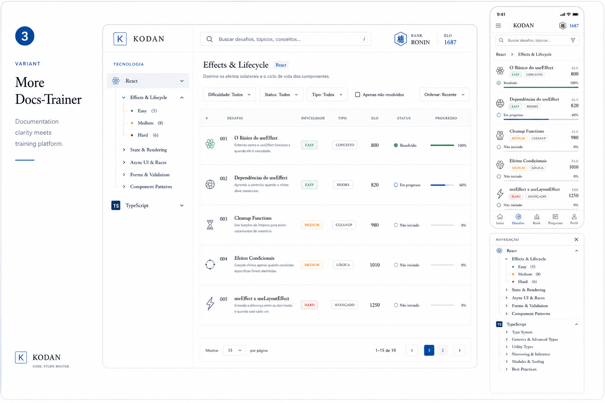

# Challenges Docs-Trainer Direction

Este documento existe para travar a direção visual da rota `/challenges` e evitar desvio de contexto entre iterações.

## Objetivo

Transformar `/challenges` em um explorer de treino no estilo `Docs-Trainer`.

O foco não é um mural de cards, nem uma árvore ornamental de nós. O foco é:

- leitura rápida
- hierarquia clara
- densidade de produto
- sensação de documentação treinável
- inspeção lateral do item ativo

## Referências

### Board de variantes

### Variante aprovada como base

## Escolha Fechada

A rota `/challenges` deve seguir a variante `3`, `More Docs-Trainer`.

Isto significa:

- centro da tela dominado por uma lista estruturada de desafios
- coluna esquerda com navegação temática e contexto leve
- coluna direita com painel auxiliar ou inspetor
- estética mais próxima de produto documental do que de dojo atmosférico
- azul contido como acento principal
- superfícies claras, limpas, com bordas leves

## Descrição do Produto Nesta Tela

O usuário entra em `/challenges` para varrer, filtrar e selecionar exercícios de leitura de código.

Essa tela não é a arena do treino. Ela é o catálogo operacional do treino.

A experiência deve responder a três perguntas em poucos segundos:

1. Onde eu estou na taxonomia de desafios?
2. Qual exercício faz sentido para o meu nível agora?
3. O que acontece se eu abrir este item?

## Arquitetura Visual Obrigatória

### Coluna esquerda

Função:

- contexto da tecnologia
- árvore de navegação
- recorte temático

Regras:

- mais estreita e mais quieta que o centro
- sem blocos gigantes empilhados
- sem textura pesada de papel
- deve parecer navegação de docs

### Centro

Função:

- lista principal de desafios
- busca
- filtros
- ordenação

Regras:

- é a área dominante da tela
- cada desafio aparece como linha estruturada, não como card solto
- alta legibilidade horizontal
- progresso, status, ELO e tags devem ser escaneáveis em uma passada

### Coluna direita

Função:

- inspetor do desafio ativo
- contexto resumido
- navegação entre itens
- CTA para abrir a arena

Regras:

- deve complementar, não competir com a lista
- menos densa que o centro
- sem virar um segundo layout principal

## Anatomia da Linha do Desafio

Cada linha da lista precisa conter:

- índice
- ícone ou marcador discreto
- título
- subtítulo curto ou descrição curta
- tags compactas
- dificuldade
- ELO
- status textual
- barra de progresso

O status deve ser lido sem abrir o painel lateral.

## Princípios de Estilo

- branco e azul, não creme e vermelho
- documentação com treinamento, não pergaminho com decoração
- tipografia precisa e silenciosa
- sombra sutil
- bordas leves e consistentes
- densidade de interface maior no centro
- menos ornamento, mais estrutura

## Coisas que Não Devem Voltar

- árvore central ornamental com cards conectados
- “papel sobre papel” em todas as colunas
- três áreas com o mesmo peso visual
- cards altos demais na área principal
- textura forte competindo com texto
- atmosfera de dojo dominando uma tela que deveria parecer produto documental

## Arquivos-Alvo

Os principais arquivos desta adaptação são:

- `apps/web/src/app/dashboard/challenges/challenges-page-client.tsx`
- `apps/web/src/app/dashboard/challenges/challenges-shell.tsx`
- `apps/web/src/app/dashboard/challenges/challenges-focus-panel.tsx`
- `apps/web/src/app/dashboard/challenges/challenges-explorer-list.tsx`
- `apps/web/src/app/dashboard/challenges/challenges-list-state.ts`
- `apps/web/src/app/dashboard/challenges/ema-challenge-card-helpers.ts`

## Checklist de Convergência

- coluna esquerda parece navegação de docs
- centro parece explorer de desafios
- coluna direita parece inspetor
- a lista central é mais importante que qualquer textura
- a página toda parece uma ferramenta de estudo, não uma ilustração de moodboard
